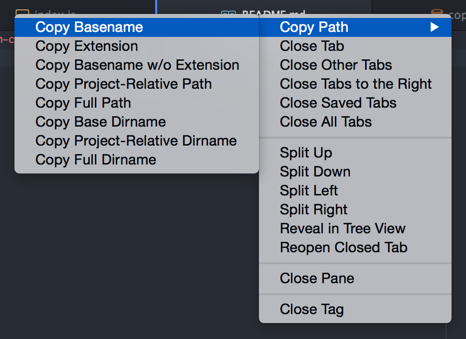

# copy-path

Copy a file path flexibly!

## Context Menu on Tabs

## Command Pallete

The path of the active text editor is target.

* `copy-path:copy-basename`
* `copy-path:copy-extension`
* `copy-path:copy-basename-wo-extension`
* `copy-path:copy-project-relative-path`
* `copy-path:copy-full-path`
* `copy-path:copy-base-dirname`
* `copy-path:copy-project-relative-dirname`
* `copy-path:copy-full-dirname`

## License

The MIT License.
